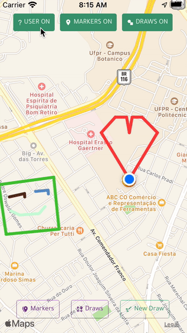
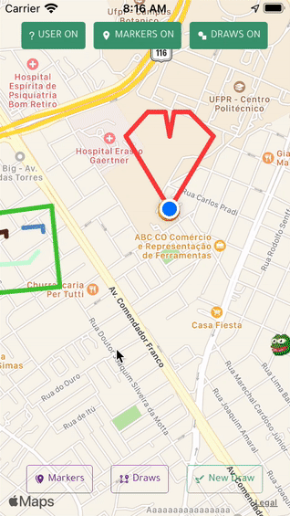
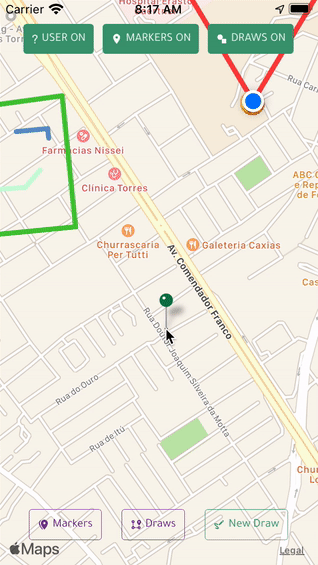
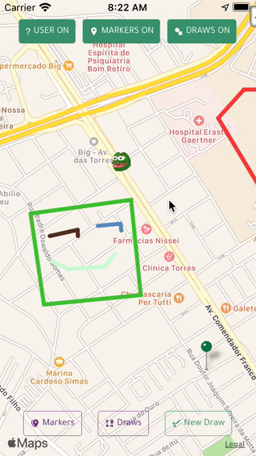
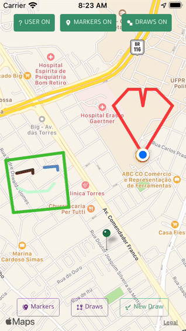
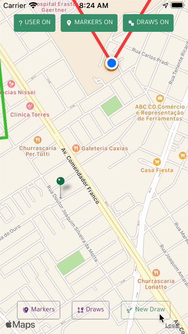
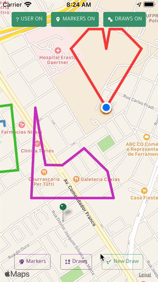

<h1 align="center">
  Imago  🗺
</h1>

Add custom markers and draws to a map!

<div style="color:#333333">

### 😶 What's the goal of this project?

This application was developed as an assignment for the mobile development course from the Systems Analysis and Development graduation course of the Federal University of Parana. The objective is to practice with maps in a react native application (using the [react-native-maps](https://github.com/react-native-maps/react-native-maps) library).   

The requirements of this project involves:
- Add markers in the map (something like 'my favourite places')  
- Fill some info about the added marker
- Persist the markers using the [JSON Server](https://github.com/typicode/json-server)  
- After adding the marker, the user must have the option to edit or remove the marker  
- Request data from the given API to fetch user info   

### 🖥 How do these stuff work?

The application was made using ```expo init```. The libraries used in this project are [React](https://pt-br.reactjs.org/), [React-Native](https://reactnative.dev/), [React-Navigation](https://reactnavigation.org/), [React Native Elements](https://reactnativeelements.com/), [React Native Maps](https://github.com/react-native-maps/react-native-maps) and everything that comes with [Expo](https://expo.io/).   

Apart from the Splash Screen, the application has only the main screen, that is the Map Screen. When the application is loaded, it will request location permissions and, if granted, will display the map screen centered in the user's current location, otherwhise will fallback to a default location.   
In this screen the user has some **controls on the top that can display and hide markers, draws and the user** position. In the **bottom part of the screen are the controls to show the markers list, draws list and add new draw**. When the user **enters the 'draw mode' the options are to save the draw or to cancel the draw**.
A single quick touch in the map resets the screen, this mean that if a list is being displayed, it will be hided. A long single touch will add a marker and when this happen, a screen will pop up with the form to fill info about the marker. A similar behavior happens when the user saves a draw: a screen pops up with the form about the draw.
These same forms appears when a marker or a draw is selected. Notice that **a marker can be selected by touching it on the map and a draw can be selected by selecting it in the draws list**. When a new marker is added, the icon will be randomized. If the regular pin is selected, it's color will be randomized as well.
When navigating through the horizontal list of the markers, whenever the user touchs a marker, the screen will try to center the point. When navigating the horizontal list of draws, whenever the user touchs a draw, the respective draw will be selected and the draw form will show with the draw's info and the screen will try to center in one of the points that is part of the draw.
To remove either the marker or the draw, when one of these elements is selected, a remove button will be presented.

### 🔭 Overview of the application

Fig 1 - Splash screen


Fig 2 - Changing the display's controls



Fig 3 - Adding a new marker



Fig 4 - Editing an existing marker



Fig 5 - Listing existing markers


Fig 6 - Deleting a marker

   

Fig 7 - Selecting and editing a draw



Fig 8 - Adding a new draw



Fig 9 - Deleting an existing draw



### 🚜 What is under the hood?

Is just a React Native App build with Expo framework that uses React Navigation, React Native Maps, JSON Server and React Native Elements
#### General
- [NPM](https://www.npmjs.com/)
- [React](https://pt-br.reactjs.org/)
- [React-Native](https://reactnative.dev/)
- [React-Navigation](https://reactnavigation.org/)
- [React Native Maps](https://github.com/react-native-maps/react-native-maps)
- [JSON Server](https://github.com/typicode/json-server) 
- [React Native Elements](https://reactnativeelements.com/)
- [Expo](https://expo.io/)

> Note: Make sure you have Node v12.* or above, NPM in command line and the Expo CLI

### 🎛 So... How to set up the environment?

As mentioned before, it's required to have Node with version 12 or above, NPM in command line and Expo CLI.

One (very) important thing that you need to do is create an ```.env``` file. In the root of the project there's a ```.env.example``` file. Create a copy of this one and remove the .example portion of the name. In this file, there's only one variable: ```FAKE_BACKEND_BASE_URL```. You need to provide the url of the JSON server here according with the device that you will run this app.

> Seriously, this .env is SUPER important

There are basically three steps to make everything work:
1.Install the dependencies
2.Start the JSON Server
3.Start the App

To make it easy to start the JSON server, a scrip was created:
```bash
$ npm run server
```

So, the steps to run everything is

```bash
# In the root directory of the application:
$ npm install       # This will download and install all of the dependencies
$ npm run server    # This will start the server
# Note that running the server with this command, you will be no longer able
# to run other commands in the samn terminal. So open another terminal to
# continue
#
# In a new terminal
$ expo start        # This will start the application
```

After that the application will be available through the Metro Bundler and the user can run it in the Android or iOS emulator or on physical devices.

</div>